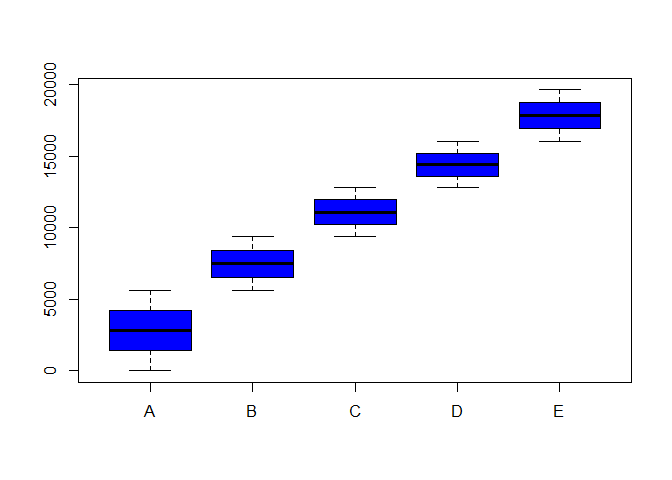

#  Construction of a machine learning algorithm to predict activity quality from activity monitors
iair kleiman  
May 17, 2015  

### Summary

The objective of this work is to be able to make a good classifier algorithm to predict how good the exercise was performed.  We performed the Data Cleaning, Validation, will run several Machine learning algorithms. We did a cross validation of the data and found out that the best model for this data set was a Random Forest.


### Getting Data

We'll begin with the usual package loading. Some remarks about the packages.  plyr was needed in some models, and plyr needs to be loaded before DPLYR or may cause problems. I didn't needed DMwR with this data set. But the KNNImputation function is pretty important to have it present specially when the data has NAs values and we are looking to replace them.


```r
library(caret)
```

```
## Loading required package: lattice
## Loading required package: ggplot2
```

```r
library(plyr)
suppressMessages(library(dplyr))
library(ggplot2)
suppressMessages(library(Hmisc))
library(DMwR)
```

```
## 
## Attaching package: 'DMwR'
## 
## The following object is masked from 'package:plyr':
## 
##     join
```

```r
library(rattle)
```

```
## Rattle: A free graphical interface for data mining with R.
## Versión 3.4.1 Copyright (c) 2006-2014 Togaware Pty Ltd.
## Escriba 'rattle()' para agitar, sacudir y  rotar sus datos.
```

Loading the files had a couple of tricks. To begin with there were many different NA arguments.  Also the variable classes between the training file and the testing file didn't match.  That was because some columns in the training file had mostly NA values but also some numbers. The testing file on the other hand those columns had only NA values, so R gave them the class of "Logic".

```r
trainingURL<- "https://d396qusza40orc.cloudfront.net/predmachlearn/pml-training.csv"
filename1 <- "training_machine.csv"
if (!file.exists(filename1)) download.file(trainingURL,destfile=filename1, mode="curl")
training <- read.csv("training_machine.csv",  na.strings=c("","NA", "NULL", "#DIV/0!")) # stringsAsFactors = FALSE

testingURL<- "https://d396qusza40orc.cloudfront.net/predmachlearn/pml-testing.csv"
filename2 <- "testing_machine.csv"
if (!file.exists(filename2)) {download.file(url=testingURL, destfile="testing_machine.csv")}
testing <- read.csv("testing_machine.csv", header=T, na.strings=c("","NA", "NULL", "#DIV/0!")) # stringsAsFactors = FALSE

testing[] <- mapply(FUN = as,testing,sapply(training,class),SIMPLIFY = FALSE)
```


### Cleaing the Data

I did the data cleaning on steps.  First I removed all the columns that were completely filled with NA values.  Then I noticed that some columns had less than 10% Data, I tried to run the KNNImputation function, but didn't worked with so many missing values, so I had to remove this columns also.

When I tried to run the KNN model, I had problems with the Raw Date variables. I excluded those variables because data values shouldn't been important on this data set prediction nor developing a model for future data classification.

Also for the same reason I also removed all the first variables columns because they didn't had information related to the measures or the sensors.

One particular variable to be removed was the X columns, which is really the index of the data set. Is evident with the next plot, that the data was already sorted by Classification type.  


```r
boxplot( X~factor(classe), data=training, col = "blue")
```

 

Without removing the X column, every data set with an X value lower than 4500 will give a prediction of A, because of strong correlation between Classification vs X  (just because the data was presorted)


```r
training_not_na  <- training[ , !apply(is.na(training), 2, all)] # remove columns with ALL NA values
training_not_na <- training_not_na[, colSums(is.na(training_not_na))/nrow(training_not_na)  <0.9] 
        # remove columns were NA values were more than 90% of the data
training_not_na <- training_not_na %>% select(-starts_with("raw")) 
training_not_na <- training_not_na %>% select(-(X:num_window))
```


### NA values removal

In this case wasn't needed but I found this so useful than preferred to keep the coded. This package and function will replace NA values via a KNN replacement algorithm.  Most of the time this will be pretty useful.

```r
require(DMwR)
training_knn<-knnImputation(training_not_na,k=5)
```

```
## Warning in knnImputation(training_not_na, k = 5): No case has missing
## values. Stopping as there is nothing to do.
```


### Training Data Partition and Train Control Parameters

At first I tried to run the train functions with a large Training data set (p=0.75). I also ran the train function without changing the trainControl parameters.  It just took too much time! Random Forest ran for 14 hours.

I decided to sacrify accuracy for speed, so I choose a smaller training data set (p=40%), also change the trainControl parameters, the time dropped from 14 hours to 15 minutes!


```r
set.seed(1976)
trainIndex <- createDataPartition(training_knn$classe, p = 0.4, list = FALSE)
Train_Part <- training_knn[ trainIndex,]
Test_Part  <- training_knn[-trainIndex,]
```


```r
tControl <- trainControl(repeats=3,number=5)
tControl_RF <- trainControl(method="cv",number=5)
```


### Training, Cross Validation and Model Accuracy Grading

OK, so I ran Random Forest, Boosting, KNN, R Part and Bayesian Generalized Linear Models.

Here are the model results, which include both cross validation with the training data set (40%) and confusion Matrices based on the testing data set (60%). When I talk about testing data set, I'm talking about the remaining of the training data set that wasn't used with the Train function, not the small 20x160 file downloaded. That file was only used for the part2 submission.


#### A. Random Forest

Random Forest was the most accurate model, but also the slowest one. While running modFitRF$finalModel, R runs a confusion matrix on the training data itself, and most of the data fall on the matrix diagonal. 

Performing a Cross Validation, with the rest of the Training Values (the Testing data set), also most of the values fall in the Confusion Matrix Diagonal, and this model cross validation, returned an accuracy of 0.9878.

This model returned high Sensitivity and Specificity.


```r
modFitRF <- train(classe ~ ., data=Train_Part, method="rf", prox=T, trControl=tControl_RF)
modFitRF
```

```
## Random Forest 
## 
## 7850 samples
##   52 predictor
##    5 classes: 'A', 'B', 'C', 'D', 'E' 
## 
## No pre-processing
## Resampling: Cross-Validated (5 fold) 
## 
## Summary of sample sizes: 6279, 6280, 6281, 6280, 6280 
## 
## Resampling results across tuning parameters:
## 
##   mtry  Accuracy   Kappa      Accuracy SD  Kappa SD   
##    2    0.9816558  0.9767883  0.001230301  0.001562016
##   27    0.9812732  0.9763082  0.003208052  0.004060695
##   52    0.9777064  0.9717948  0.004032364  0.005101782
## 
## Accuracy was used to select the optimal model using  the largest value.
## The final value used for the model was mtry = 2.
```

```r
modFitRF$finalModel
```

```
## 
## Call:
##  randomForest(x = x, y = y, mtry = param$mtry, proximity = ..1) 
##                Type of random forest: classification
##                      Number of trees: 500
## No. of variables tried at each split: 2
## 
##         OOB estimate of  error rate: 1.32%
## Confusion matrix:
##      A    B    C    D    E class.error
## A 2224    5    1    1    1 0.003584229
## B   18 1492    9    0    0 0.017774852
## C    1   24 1342    2    0 0.019722425
## D    0    0   31 1254    2 0.025641026
## E    0    0    5    4 1434 0.006237006
```

```r
predRF <- predict(modFitRF, Test_Part)
confusionMatrix(predRF, Test_Part$classe)
```

```
## Confusion Matrix and Statistics
## 
##           Reference
## Prediction    A    B    C    D    E
##          A 3338   24    0    0    0
##          B   10 2240   32    0    0
##          C    0   14 2013   45    1
##          D    0    0    8 1881    7
##          E    0    0    0    3 2156
## 
## Overall Statistics
##                                           
##                Accuracy : 0.9878          
##                  95% CI : (0.9856, 0.9897)
##     No Information Rate : 0.2844          
##     P-Value [Acc > NIR] : < 2.2e-16       
##                                           
##                   Kappa : 0.9845          
##  Mcnemar's Test P-Value : NA              
## 
## Statistics by Class:
## 
##                      Class: A Class: B Class: C Class: D Class: E
## Sensitivity            0.9970   0.9833   0.9805   0.9751   0.9963
## Specificity            0.9972   0.9956   0.9938   0.9985   0.9997
## Pos Pred Value         0.9929   0.9816   0.9711   0.9921   0.9986
## Neg Pred Value         0.9988   0.9960   0.9959   0.9951   0.9992
## Prevalence             0.2844   0.1935   0.1744   0.1639   0.1838
## Detection Rate         0.2836   0.1903   0.1710   0.1598   0.1831
## Detection Prevalence   0.2856   0.1938   0.1761   0.1611   0.1834
## Balanced Accuracy      0.9971   0.9894   0.9872   0.9868   0.9980
```

```r
predRF_Testing <- predict(modFitRF, testing) 
predRF_Testing
```

```
##  [1] B A B A A E D B A A B C B A E E A B B B
## Levels: A B C D E
```


#### B. Boosting

This was the 2nd best model. Also most of the testing data fell in the Confusion Matrix Diagonal, giving a Cross Validation accuracy of 0.9572.  Was a very good model, specially considering it's speed.  It's a good "bang for your buck" model!


```r
set.seed(100)
modFitBoost <- train(classe ~. , data=Train_Part, method="gbm", trControl=tControl, verbose=FALSE)
modFitBoost
```

```
## Stochastic Gradient Boosting 
## 
## 7850 samples
##   52 predictor
##    5 classes: 'A', 'B', 'C', 'D', 'E' 
## 
## No pre-processing
## Resampling: Bootstrapped (5 reps) 
## 
## Summary of sample sizes: 7850, 7850, 7850, 7850, 7850 
## 
## Resampling results across tuning parameters:
## 
##   interaction.depth  n.trees  Accuracy   Kappa      Accuracy SD
##   1                   50      0.7415059  0.6720700  0.006620380
##   1                  100      0.8113342  0.7611191  0.004769085
##   1                  150      0.8439669  0.8024643  0.006155694
##   2                   50      0.8486323  0.8081084  0.006135948
##   2                  100      0.9012447  0.8749618  0.003978259
##   2                  150      0.9252658  0.9053671  0.003571282
##   3                   50      0.8934376  0.8649891  0.009935845
##   3                  100      0.9349199  0.9175719  0.005647600
##   3                  150      0.9529340  0.9404124  0.003662801
##   Kappa SD   
##   0.008806440
##   0.005927415
##   0.007958504
##   0.007917235
##   0.005073565
##   0.004611830
##   0.012619240
##   0.007142401
##   0.004587535
## 
## Tuning parameter 'shrinkage' was held constant at a value of 0.1
## 
## Tuning parameter 'n.minobsinnode' was held constant at a value of 10
## Accuracy was used to select the optimal model using  the largest value.
## The final values used for the model were n.trees = 150,
##  interaction.depth = 3, shrinkage = 0.1 and n.minobsinnode = 10.
```

```r
modFitBoost$finalModel
```

```
## A gradient boosted model with multinomial loss function.
## 150 iterations were performed.
## There were 52 predictors of which 42 had non-zero influence.
```

```r
predBoost <- predict(modFitBoost, Test_Part)
confusionMatrix(predBoost, Test_Part$classe)
```

```
## Confusion Matrix and Statistics
## 
##           Reference
## Prediction    A    B    C    D    E
##          A 3289   88    0    4    6
##          B   30 2120   65    4   53
##          C   20   61 1968   63   25
##          D    5    4   19 1843   32
##          E    4    5    1   15 2048
## 
## Overall Statistics
##                                           
##                Accuracy : 0.9572          
##                  95% CI : (0.9534, 0.9608)
##     No Information Rate : 0.2844          
##     P-Value [Acc > NIR] : < 2.2e-16       
##                                           
##                   Kappa : 0.9458          
##  Mcnemar's Test P-Value : < 2.2e-16       
## 
## Statistics by Class:
## 
##                      Class: A Class: B Class: C Class: D Class: E
## Sensitivity            0.9824   0.9306   0.9586   0.9554   0.9464
## Specificity            0.9884   0.9840   0.9826   0.9939   0.9974
## Pos Pred Value         0.9711   0.9331   0.9209   0.9685   0.9879
## Neg Pred Value         0.9930   0.9834   0.9912   0.9913   0.9880
## Prevalence             0.2844   0.1935   0.1744   0.1639   0.1838
## Detection Rate         0.2794   0.1801   0.1672   0.1566   0.1740
## Detection Prevalence   0.2877   0.1930   0.1815   0.1617   0.1761
## Balanced Accuracy      0.9854   0.9573   0.9706   0.9747   0.9719
```

```r
predBoost_Testing <- predict(modFitBoost, testing)
predBoost_Testing
```

```
##  [1] B A B A A E D B A A B C B A E E A B B B
## Levels: A B C D E
```


#### C. K Neighbour Numbers

Lower Cross Validation Accuracy of 0.848.


```r
modFitknn <- train(classe ~. , data=Train_Part, method="knn", trControl=tControl)
modFitknn
```

```
## k-Nearest Neighbors 
## 
## 7850 samples
##   52 predictor
##    5 classes: 'A', 'B', 'C', 'D', 'E' 
## 
## No pre-processing
## Resampling: Bootstrapped (5 reps) 
## 
## Summary of sample sizes: 7850, 7850, 7850, 7850, 7850 
## 
## Resampling results across tuning parameters:
## 
##   k  Accuracy   Kappa      Accuracy SD  Kappa SD   
##   5  0.8060512  0.7545598  0.008883068  0.011190263
##   7  0.7896852  0.7337490  0.005442673  0.006967379
##   9  0.7743761  0.7144277  0.007433165  0.009492908
## 
## Accuracy was used to select the optimal model using  the largest value.
## The final value used for the model was k = 5.
```

```r
modFitknn$finalModel
```

```
## 5-nearest neighbor classification model
## Training set class distribution:
## 
##    A    B    C    D    E 
## 2232 1519 1369 1287 1443
```

```r
predknn <- predict(modFitknn, Test_Part)
confusionMatrix(predknn, Test_Part$classe)
```

```
## Confusion Matrix and Statistics
## 
##           Reference
## Prediction    A    B    C    D    E
##          A 3101  180   39   60   71
##          B   63 1772   96   22  153
##          C   61  117 1790  195   91
##          D  104  127   87 1614  143
##          E   19   82   41   38 1706
## 
## Overall Statistics
##                                           
##                Accuracy : 0.848           
##                  95% CI : (0.8414, 0.8545)
##     No Information Rate : 0.2844          
##     P-Value [Acc > NIR] : < 2.2e-16       
##                                           
##                   Kappa : 0.8077          
##  Mcnemar's Test P-Value : < 2.2e-16       
## 
## Statistics by Class:
## 
##                      Class: A Class: B Class: C Class: D Class: E
## Sensitivity            0.9262   0.7779   0.8719   0.8367   0.7884
## Specificity            0.9585   0.9648   0.9523   0.9532   0.9813
## Pos Pred Value         0.8986   0.8414   0.7941   0.7778   0.9046
## Neg Pred Value         0.9703   0.9477   0.9724   0.9675   0.9537
## Prevalence             0.2844   0.1935   0.1744   0.1639   0.1838
## Detection Rate         0.2634   0.1505   0.1521   0.1371   0.1449
## Detection Prevalence   0.2932   0.1789   0.1915   0.1763   0.1602
## Balanced Accuracy      0.9423   0.8713   0.9121   0.8949   0.8848
```

```r
predknn_Testing <- predict(modFitknn, testing)
predknn_Testing
```

```
##  [1] B A A A A E D B A A B C D A D A A B B B
## Levels: A B C D E
```


#### D. Recursive Partition - RPart

One very important lesson is to run rpart model every time you can. It's not an accurate model but is very easy to plot and understand what is going on.  For several days I was building the Machine Learning Algorithm without removing the X column, and every model gave me predicted "A" values on the downloaded testing files.  Plotting the rpart model help me realize the heavy dependency of the model with the X (index) value.  I'm plotting the corrected tree.

The cross validation accuracy was just 0.57.  But the importance of this model is not so much it's accuracy but rather the ease of understanding.


```r
modFitrpart <- train(classe ~. , data=Train_Part, method="rpart", trControl=tControl)
modFitrpart
```

```
## CART 
## 
## 7850 samples
##   52 predictor
##    5 classes: 'A', 'B', 'C', 'D', 'E' 
## 
## No pre-processing
## Resampling: Bootstrapped (5 reps) 
## 
## Summary of sample sizes: 7850, 7850, 7850, 7850, 7850 
## 
## Resampling results across tuning parameters:
## 
##   cp          Accuracy   Kappa       Accuracy SD  Kappa SD  
##   0.02830189  0.5399675  0.40635259  0.05168905   0.07809296
##   0.03856651  0.5049100  0.36187031  0.02886117   0.04566364
##   0.11480954  0.3466834  0.09583261  0.04104931   0.05386813
## 
## Accuracy was used to select the optimal model using  the largest value.
## The final value used for the model was cp = 0.02830189.
```

```r
modFitrpart$finalModel
```

```
## n= 7850 
## 
## node), split, n, loss, yval, (yprob)
##       * denotes terminal node
## 
##   1) root 7850 5618 A (0.28 0.19 0.17 0.16 0.18)  
##     2) roll_belt< 130.5 7197 4969 A (0.31 0.21 0.19 0.18 0.11)  
##       4) pitch_forearm< -33.65 640    3 A (1 0.0047 0 0 0) *
##       5) pitch_forearm>=-33.65 6557 4966 A (0.24 0.23 0.21 0.2 0.12)  
##        10) magnet_dumbbell_z< -94.5 764  297 A (0.61 0.28 0.045 0.051 0.017) *
##        11) magnet_dumbbell_z>=-94.5 5793 4458 C (0.19 0.23 0.23 0.22 0.13)  
##          22) yaw_belt>=169.5 312   45 A (0.86 0.058 0 0.074 0.013) *
##          23) yaw_belt< 169.5 5481 4146 C (0.16 0.23 0.24 0.22 0.14)  
##            46) pitch_belt< -42.95 316   47 B (0.013 0.85 0.089 0.032 0.016) *
##            47) pitch_belt>=-42.95 5165 3858 C (0.17 0.2 0.25 0.24 0.15)  
##              94) accel_dumbbell_y>=-40.5 4733 3533 D (0.18 0.21 0.21 0.25 0.15)  
##               188) magnet_dumbbell_y< 310.5 2497 1640 C (0.21 0.11 0.34 0.2 0.14) *
##               189) magnet_dumbbell_y>=310.5 2236 1527 D (0.14 0.31 0.057 0.32 0.17)  
##                 378) accel_forearm_x>=-116.5 1344  856 B (0.17 0.36 0.08 0.14 0.24) *
##                 379) accel_forearm_x< -116.5 892  370 D (0.092 0.23 0.022 0.59 0.067) *
##              95) accel_dumbbell_y< -40.5 432  110 C (0.016 0.11 0.75 0.035 0.097) *
##     3) roll_belt>=130.5 653    4 E (0.0061 0 0 0 0.99) *
```

```r
predrpart <- predict(modFitrpart, Test_Part)
confusionMatrix(predrpart, Test_Part$classe)
```

```
## Confusion Matrix and Statistics
## 
##           Reference
## Prediction    A    B    C    D    E
##          A 2018  345   53   85   33
##          B  359 1117  198  333  502
##          C  808  460 1780  698  555
##          D  153  356   22  813   92
##          E   10    0    0    0  982
## 
## Overall Statistics
##                                         
##                Accuracy : 0.57          
##                  95% CI : (0.561, 0.579)
##     No Information Rate : 0.2844        
##     P-Value [Acc > NIR] : < 2.2e-16     
##                                         
##                   Kappa : 0.4614        
##  Mcnemar's Test P-Value : < 2.2e-16     
## 
## Statistics by Class:
## 
##                      Class: A Class: B Class: C Class: D Class: E
## Sensitivity            0.6027  0.49034   0.8670  0.42146  0.45379
## Specificity            0.9387  0.85338   0.7406  0.93671  0.99896
## Pos Pred Value         0.7964  0.44520   0.4139  0.56616  0.98992
## Neg Pred Value         0.8560  0.87466   0.9635  0.89203  0.89035
## Prevalence             0.2844  0.19351   0.1744  0.16386  0.18383
## Detection Rate         0.1714  0.09489   0.1512  0.06906  0.08342
## Detection Prevalence   0.2153  0.21313   0.3654  0.12198  0.08427
## Balanced Accuracy      0.7707  0.67186   0.8038  0.67908  0.72637
```

```r
predrpart_Testing <- predict(modFitrpart, testing)

fancyRpartPlot(modFitrpart$finalModel)
```

 

```r
predrpart_Testing
```

```
##  [1] C B B C C C D D A A C C C A B B C D C B
## Levels: A B C D E
```


#### E. Bayeasian Generalized Linear Model

The most interesting thing about this model is that it wasn't able to classify correctly C,D and E values.  It was "OK" with A and B.  Overall, it had a Cross Validation Accuracy of just 0.4004


```r
modFitBAY <- train(classe ~. , data=Train_Part, method="bayesglm", trControl=tControl)
```

```
## Warning: fitted probabilities numerically 0 or 1 occurred
```

```
## Warning: fitted probabilities numerically 0 or 1 occurred
```

```
## Warning: fitted probabilities numerically 0 or 1 occurred
```

```
## Warning: fitted probabilities numerically 0 or 1 occurred
```

```
## Warning: fitted probabilities numerically 0 or 1 occurred
```

```
## Warning: fitted probabilities numerically 0 or 1 occurred
```

```r
modFitBAY
```

```
## Bayesian Generalized Linear Model 
## 
## 7850 samples
##   52 predictor
##    5 classes: 'A', 'B', 'C', 'D', 'E' 
## 
## No pre-processing
## Resampling: Bootstrapped (5 reps) 
## 
## Summary of sample sizes: 7850, 7850, 7850, 7850, 7850 
## 
## Resampling results
## 
##   Accuracy   Kappa      Accuracy SD  Kappa SD   
##   0.4000694  0.2343715  0.009616507  0.007094714
## 
## 
```

```r
modFitBAY$finalModel
```

```
## 
## Call:  NULL
## 
## Coefficients:
##          (Intercept)             roll_belt            pitch_belt  
##            4.867e+01             2.232e-01            -3.343e-01  
##             yaw_belt      total_accel_belt          gyros_belt_x  
##           -2.059e-01            -7.727e-02             2.738e+00  
##         gyros_belt_y          gyros_belt_z          accel_belt_x  
##           -8.249e-01             8.056e-01             5.575e-03  
##         accel_belt_y          accel_belt_z         magnet_belt_x  
##           -1.545e-02            -4.065e-02            -1.950e-02  
##        magnet_belt_y         magnet_belt_z              roll_arm  
##           -7.669e-02             6.480e-02             4.699e-03  
##            pitch_arm               yaw_arm       total_accel_arm  
##           -5.687e-03             4.449e-03            -1.093e-02  
##          gyros_arm_x           gyros_arm_y           gyros_arm_z  
##            1.254e-01             6.942e-03            -1.282e-01  
##          accel_arm_x           accel_arm_y           accel_arm_z  
##           -1.391e-02            -6.145e-03             2.140e-02  
##         magnet_arm_x          magnet_arm_y          magnet_arm_z  
##            1.996e-03             1.397e-05            -1.164e-02  
##        roll_dumbbell        pitch_dumbbell          yaw_dumbbell  
##            5.250e-03            -1.815e-02            -2.226e-02  
## total_accel_dumbbell      gyros_dumbbell_x      gyros_dumbbell_y  
##            2.377e-01             1.220e+00             7.415e-01  
##     gyros_dumbbell_z      accel_dumbbell_x      accel_dumbbell_y  
##            7.561e-01             4.323e-02             4.804e-03  
##     accel_dumbbell_z     magnet_dumbbell_x     magnet_dumbbell_y  
##            4.355e-03            -8.453e-03            -7.718e-03  
##    magnet_dumbbell_z          roll_forearm         pitch_forearm  
##            3.754e-02             2.623e-03             2.022e-02  
##          yaw_forearm   total_accel_forearm       gyros_forearm_x  
##           -1.938e-03             7.111e-02             3.535e-01  
##      gyros_forearm_y       gyros_forearm_z       accel_forearm_x  
##            1.397e-02            -1.184e-01             3.060e-03  
##      accel_forearm_y       accel_forearm_z      magnet_forearm_x  
##            1.361e-03            -1.268e-02            -3.244e-03  
##     magnet_forearm_y      magnet_forearm_z  
##           -1.423e-03             3.986e-04  
## 
## Degrees of Freedom: 7849 Total (i.e. Null);  7797 Residual
## Null Deviance:	    9373 
## Residual Deviance: 3588 	AIC: 3694
```

```r
predBAY <- predict(modFitBAY, Test_Part)
confusionMatrix(predBAY, Test_Part$classe)
```

```
## Confusion Matrix and Statistics
## 
##           Reference
## Prediction    A    B    C    D    E
##          A 2685  250   84   83   54
##          B  663 2028 1969 1846 2110
##          C    0    0    0    0    0
##          D    0    0    0    0    0
##          E    0    0    0    0    0
## 
## Overall Statistics
##                                           
##                Accuracy : 0.4004          
##                  95% CI : (0.3915, 0.4093)
##     No Information Rate : 0.2844          
##     P-Value [Acc > NIR] : < 2.2e-16       
##                                           
##                   Kappa : 0.2333          
##  Mcnemar's Test P-Value : NA              
## 
## Statistics by Class:
## 
##                      Class: A Class: B Class: C Class: D Class: E
## Sensitivity            0.8020   0.8903   0.0000   0.0000   0.0000
## Specificity            0.9441   0.3061   1.0000   1.0000   1.0000
## Pos Pred Value         0.8508   0.2354      NaN      NaN      NaN
## Neg Pred Value         0.9231   0.9208   0.8256   0.8361   0.8162
## Prevalence             0.2844   0.1935   0.1744   0.1639   0.1838
## Detection Rate         0.2281   0.1723   0.0000   0.0000   0.0000
## Detection Prevalence   0.2681   0.7319   0.0000   0.0000   0.0000
## Balanced Accuracy      0.8730   0.5982   0.5000   0.5000   0.5000
```

```r
predBAY_Testing <- predict(modFitBAY, testing)
predBAY_Testing
```

```
##  [1] B A B B B B B B A A B A B A B B A B B B
## Levels: A B C D E
```


### Accuracy Summary


```r
RF <-confusionMatrix(predRF, Test_Part$classe)$overall[1]
Boost <-confusionMatrix(predBoost, Test_Part$classe)$overall[1]
KNN <- confusionMatrix(predknn, Test_Part$classe)$overall[1]
RPart <-confusionMatrix(predrpart, Test_Part$classe)$overall[1]
BAY <-confusionMatrix(predBAY, Test_Part$classe)$overall[1]
```

Well, you can see the accuracy of the different models, Random Forest was the most accurate one, follow by Boosting method.  Boosting wasn't so accurate, but was definitely faster than Random Forest


```r
RF
```

```
##  Accuracy 
## 0.9877676
```

```r
Boost
```

```
##  Accuracy 
## 0.9571865
```

```r
KNN
```

```
##  Accuracy 
## 0.8480292
```

```r
RPart
```

```
##  Accuracy 
## 0.5699966
```

```r
BAY
```

```
##  Accuracy 
## 0.4003568
```


### Conclusion

Random Forest and Boosting (gbm) model worked very well and returned a high accuracy rate.


### Dataset and Literature

Ugulino, W.; Cardador, D.; Vega, K.; Velloso, E.; Milidiu, R.; Fuks, H. Wearable Computing: Accelerometers' Data Classification of Body Postures and Movements. Proceedings of 21st Brazilian Symposium on Artificial Intelligence. Advances in Artificial Intelligence - SBIA 2012. In: Lecture Notes in Computer Science. , pp. 52-61. Curitiba, PR: Springer Berlin / Heidelberg, 2012. ISBN 978-3-642-34458-9. DOI: 10.1007/978-3-642-34459-6_6. 


  
